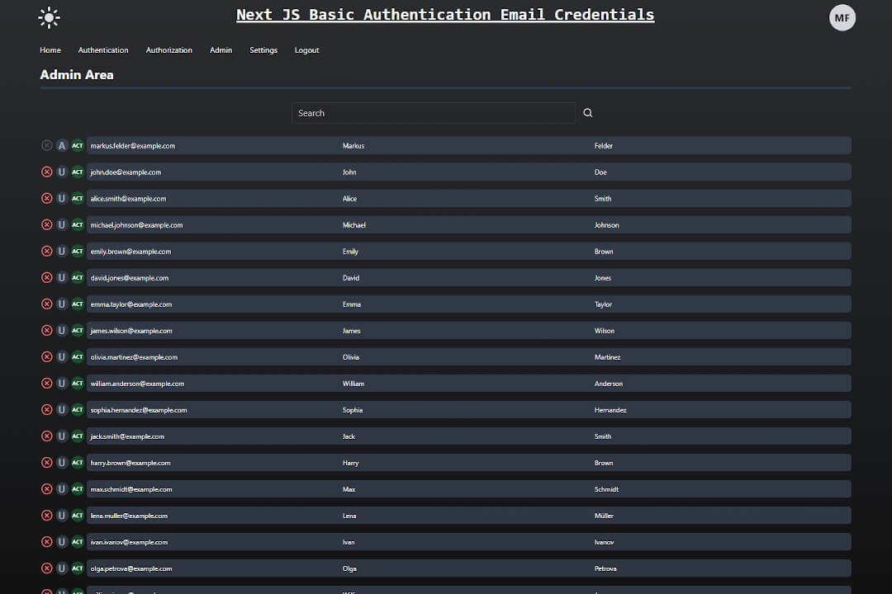

# Next.js Basic Authentication with Email Credentials and Email verification

Next.js Basic Authetication with Email Credentials and Email verification (using Resend API and automatic generated magic links for email verification and password-forget) based on Prisma ORM and SQLite (easily customizable). Admin dashboard with search functiionality for basic user administration and CRUD methods included. Toggle Light and dark mode based on Session Cookies also included as additional feature. It is an authentication boilerplate for Next JS (app directory and SSR) and a solid starting point for many types of websites (blog, ecommerce, etc.)



## Features

- Basic authentication with email and password credentials
- Basic protection of websites using session cookies and user roles
- user has to confirm registration via email verification
- user (role USER) can update his/her settings, reset password and get link via email for setting new password
- user (role USER) can delete the account inside the danger zone (modal confirmation)
- user (role ADMIN) can make CRUD operations on users on the admin dashboard
- toggle light/dark mode (current fallback theme is dark)

## Tech Stack

- Next.js@14.1
- Prisma ORM (using SQLite database)
- Zod verification
- Tailwind CSS
- Resend API for basic transactional emails

## Using session cookies for persistence

Authentication and toggle light and dark mode are based on the extensive use of session cookies. The validity period of the individual cookies and magic links can be adjusted in the `@lib/constants` file.

## No NextAuth - Using own authentication and encryption functions

Since NextAuth only provides an additional layer of abstraction layer for the authentication process and we are not using 3rd-party-authentication providers, we use our own authentication and encryption methods and protect sensitive areas of the website within the middleware with session tokens and authorization access for certain roles. Although NextAuth´s documentation [warns](https://next-auth.js.org/providers/credentials) against the use of email credentials with passwords due to additional complexity associated with supporting usernames and passwords you could also argue why the improper integration of 3rd party providers represents any advantage of security. I disagree with them in this point. There are often good reasons to use your own authentication system with email and password and to have full control over the use of your data.

## Getting Started

This is a [Next.js](https://nextjs.org/) project bootstrapped with [`create-next-app`](https://github.com/vercel/next.js/tree/canary/packages/create-next-app).

### Add Secret Key and Resend API key to your environmental variables

To work properly you need to add a SECRET_KEY and a RESEND_API token [Link to Resend.com](https://resend.com/) to your environmental variables in the root directory of your local storage `.env.local`.

```bash
SECRET_KEY=xxxxxxxxxxxxxxxxxxxxxxxxxxxxx
RESEND_API_KEY=xxxxxxxxxxxxxxxxxxxxxxxxxxxxxxxxxxxx
```

### Customize Settings

You can adjust your settings (expiring dates of the session token and magic links in seconds) to your requirements at `@/lib/constants.ts`

```typescript
export const SESSION_EXPIRING_SECONDS = 24 * 60 * 60; /* 24 hours */
export const THEME_EXPIRING_SECONDS = 24 * 60 * 60; /* 24 hours */
export const EMAIL_VERIFICATION_LINK_VALID_SECONDS = 60 * 60; /* 1 hour */
export const EMAIL_PASSWORD_RESET_LINK_VALID_SECONDS = 15 * 60; /* 15 minutes */
export const DROPDOWN_MENU_DELAY = 180;
export const THROTTLE_EMAIL_DISPATCH_IN_MILLISECONDS = 1000 * 60 * 5; /* only 1 email can be sent every 5 minutes */
export const FALLBACK_THEME: Theme = 'dark'; /* Dark mode is standard theme*/
export const INITIAL_ERROR_STATE = {
	formErrors: [] as string[],
	fieldErrors: {},
};
export const STATUS_TAILWIND_BG_COLORS: Record<string, string> = {
	REGISTERED: 'bg-yellow-700/50',
	ACTIVE: 'bg-green-700/50',
	INACTIVE: 'bg-red-700/50',
};
```

### Start Development Server

Run the development server:

```bash
npm run dev
# or
yarn dev
# or
pnpm dev
# or
bun dev
```

Open [http://localhost:3000](http://localhost:3000) with your browser to see the result.

## Seeding Prisma Database

Fill in 20 dummy accounts: `npx prisma db seed`
You can customize the dummies according to your wishes in the `@prisma/dummyUser.json` file.

## Test

To run vitest you can call

```bash
npm run test
# or
yarn test
# or
pnpm test
# or
bun test

```

## Learn More

To learn more about Next.js, take a look at the following resources:

- [Next.js Documentation](https://nextjs.org/docs) - learn about Next.js features and API.
- [Learn Next.js](https://nextjs.org/learn) - an interactive Next.js tutorial.

You can check out [the Next.js GitHub repository](https://github.com/vercel/next.js/) - your feedback and contributions are welcome!

## Deploy on Vercel

The easiest way to deploy your Next.js app is to use the [Vercel Platform](https://vercel.com/new?utm_medium=default-template&filter=next.js&utm_source=create-next-app&utm_campaign=create-next-app-readme) from the creators of Next.js.

Check out our [Next.js deployment documentation](https://nextjs.org/docs/deployment) for more details.
